# CI/CD Pipeline Project

#### For this project I will be continuing with my Flask app project that I worked on when looking at Docker, for this project I will create a pipeline that automatically runs when code is pushed to Github it will: 
- installs dependencies
- runs tests
- build a Docker image
- push the image to Docker Hub.

## - Creating a test folder -

#### Currently my directory looks like this:

```
flaskapp/
├── tests/
│   └── test_app.py
├── app.py
├── requirements.txt
├── Dockerfile
├── .dockerignore
└── README.md
```

#### Now I have created a test folder and have added a file called "test_app.py" and have added the following code
```
def test_example():
    assert 1 + 1 == 2
```

#### This code is completing a very simple test to ensure that 1 + 1 = 2, the test should pass, the reason for adding this is that my CI/CD pipeline will need something to test automatically, if the test passes then the pipeline will continue if it fails then the pipeline will stops, this is the "Continuous Integration" of the CI/CD pipeline. 

## - Pytest - 

#### This is a Python testing framework that I will be using, it automatically finds test files, runs the test files and then reports pass/fail results. To incorporate pytest I will add it into my requirements.txt file

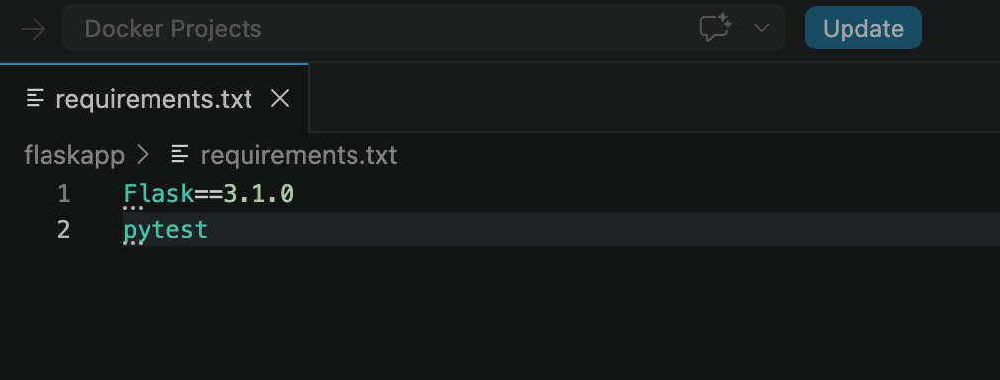 

#### Now that I have added pytest into my requirements file I will need to install the requirements, I will so this by using the following command 

```
pip3 install -r requirements.txt
```

#### To test that pytest has successfully installed I can use the following command to test it's version 

```
python3 -m pytest --version
```
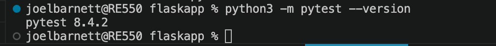

#### I can now run my test using the following command

```
python3 -m pytest
```

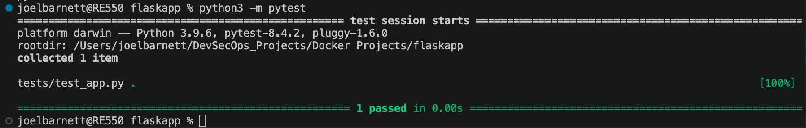

#### After running the command pytest will have automatically found the tests folder, found test_app.py and then found the function I created, it has then ran the test and confirmed that it passed.

#### To truly test that my pytest is working I will change the equation so that it fails, this should create a fail which pytest should make me aware of.

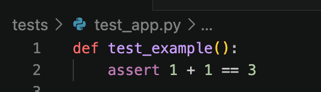
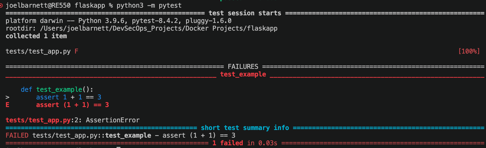

#### This proves that my pytest is working as intended, I shall now change the equation back to what it was, after running this test my project structure looks like the following

```
flaskapp/
├── tests/
│   └── test_app.py
├── app.py
├── requirements.txt
├── Dockerfile
├── .dockerignore
└── README.md
```

## - Creating a Github actions folder -
#### to create this folder I will use the CLI interface, the command I shall enter into the terminal is 

```
mkdir -p .github/workflows
```

#### Then I will create the workflow file with this command

```
touch .github/workflows/ci-cd.yml
```
#### To check that these two steps have worked I can use the ls command, I will input the following into the terminal, if it has worked then I should see ".github"

```
ls -la
```
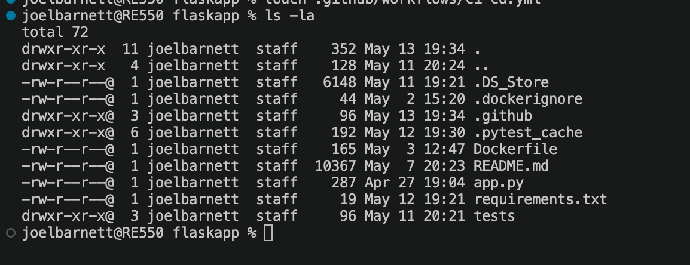

#### To check that my yml file was created I can run the following ls command

```
ls -la .github/workflows
```

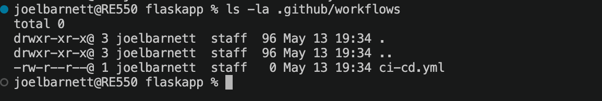

## - Creating the CI/CD workflow - 
#### Github actions workflows are YAML files, the workflow will be under the actions tab of Github, within my ci-cd.yml file I have the following

```
name: CI/CD Pipeline

on:
  push:
    branches:
      - main
  pull_request:
    branches:
      - main

jobs:
  test-build-push:
    runs-on: ubuntu-latest

    steps:
      - name: Checkout repository
        uses: actions/checkout@v4

      - name: Set up Python
        uses: actions/setup-python@v5
        with:
          python-version: "3.12"

      - name: Install dependencies
        run: |
          pip install --upgrade pip
          pip install -r requirements.txt

      - name: Run tests
        run: pytest

      - name: Log in to Docker Hub
        if: github.event_name == 'push'
        uses: docker/login-action@v3
        with:
          username: ${{ secrets.DOCKER_USERNAME }}
          password: ${{ secrets.DOCKER_TOKEN }}

      - name: Build and push Docker image
        if: github.event_name == 'push'
        uses: docker/build-push-action@v6
        with:
          context: .
          push: true
          tags: cptbarnett101/flaskapp:latest
```

#### I will breakdown segments of the file to explain what each part does

```
on:
  push:
    branches:
      - main
  pull_request:
    branches:
      - main
```

#### This part of the file will run this pipeline when the code is pushed to main, it will also run this pipeline when a pull request targets main too.

```
jobs:
  test-build-push:
    runs-on: ubuntu-latest
```
#### This section will create a job, this is a group of steps, in this case Github will run the pipeline on a temporary Ubuntu Linux machine

```
- name: Checkout repository
  uses: actions/checkout@v4
```
#### This part will download the repository code into the runner, without this Github actions would start with an empty machine. 

```
- name: Set up Python
  uses: actions/setup-python@v5
  with:
    python-version: "3.12"
```

#### This part will install Python version 3.12

```
- name: Install dependencies
  run: |
    pip install --upgrade pip
    pip install -r requirements.txt
```
#### This part will read the requirements.txt file and then install the dependencies listed, in this case that will be flask and pytest

```
- name: Run tests
  run: pytest
```
#### This part will run my pytest, if the test is successful then the pipeline will continue, if not then it stop.

```
- name: Log in to Docker Hub
  if: github.event_name == 'push'
  uses: docker/login-action@v3
  with:
    username: ${{ secrets.DOCKER_USERNAME }}
    password: ${{ secrets.DOCKER_TOKEN }}
```

#### This part will log into Docker Hub, the username and token will not be written directly in the file, they will be stored as Github repository secrets to follow best practice. 

```
- name: Build and push Docker image
  if: github.event_name == 'push'
  uses: docker/build-push-action@v6
  with:
    context: .
    push: true
    tags: yourdockerhubusername/flaskapp:latest
```
#### This section uses Docker's official build-push action, this is how Docker images are pushed and built within Github actions
#### The "context: ." will build the docker image using the current project folder

```
if: github.event_name == 'push'
```
#### This part will ensure that the Docker Hub login and Docker push will only occur when code is pushed to main, for pull requests the pipeline will run tests but will not push a Docker image, this follows best practice. The reason for this is that if a developer created a pull request that had broker or unfinished code and the github.event_name check was not there then the broken or unfinished code could be deployed. 

## - Adding the repository secrets - 
#### Since my workflow will use the Docker username and Docker token from the repository secrets I will need to generate a docker token for this. I went to Docker Hub and generated a token, I then went to my Github repository and then created two new secrets, one named "DOCKER_USERNAME" and one named "DOCKER_TOKEN".

## - Commit and Push - 
#### Now that I have created my workflow and created my repository secrets I can now commit and push my code to Github. 

#### first of all I will use the "pwd" command to check ensure my terminal has opened from my project folder

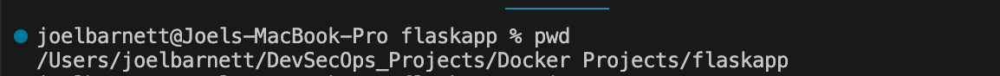 

#### Now I will initialise git so that it will be set up to be used, I will do this with "git init"
#### To check this has worked I shall run "git status"

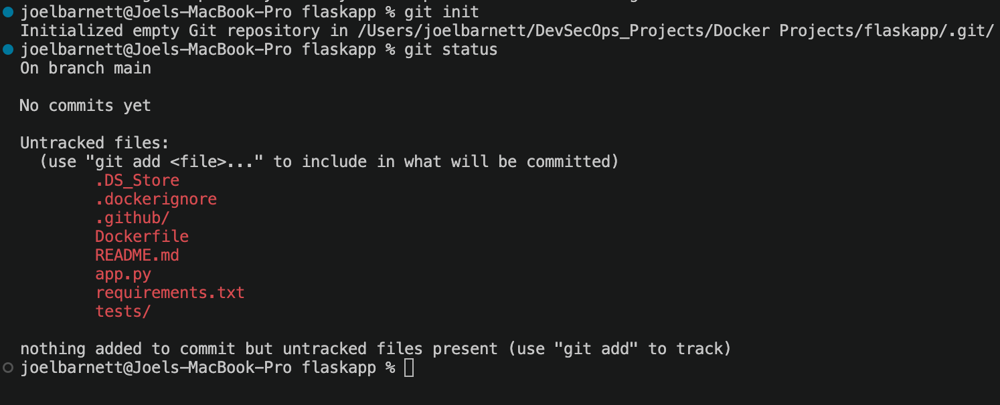 

#### As can be seen in the above image, no files have been added to Git staging, which is why they are highlighted in red, so I will run the following command to add all the changed files

```
git add .
```
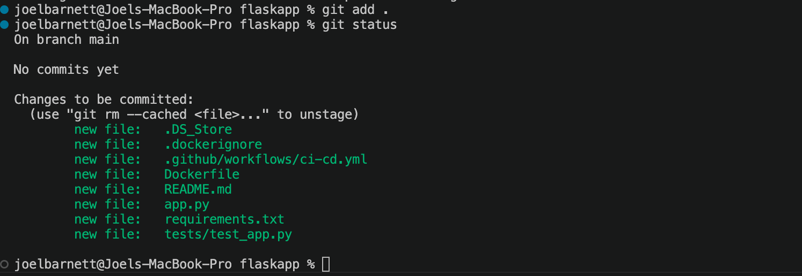

#### After running the above, the files that were once red have now turned green meaning they have been added to Git staging
#### Now that my files have been added, I will run the following command

```
git commit -m "Add CI/CD pipeline with GitHub Actions"
```
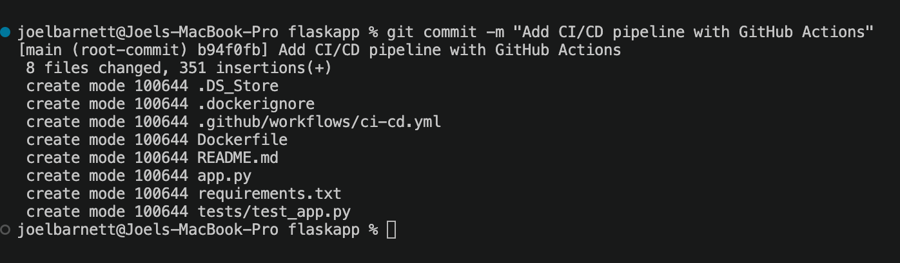

#### These changes will go directly to the main branch, this has been decided by the "-m" , I have also added a commit message to follow best practice. 

#### Before I commit the code, I will tell git which repository I would like to target, I do this with the following command, I will now be able to refer to my chosen GitHub repository with the name "origin"
```
git remote add origin https://github.com/JBarnett775/CI-CD-Pipeline-Project.git
```
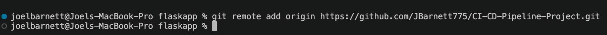

#### Now that I have set my chosen repository, I will push the changes to GitHub with the following command

```
git push origin main
```

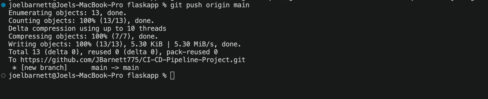 
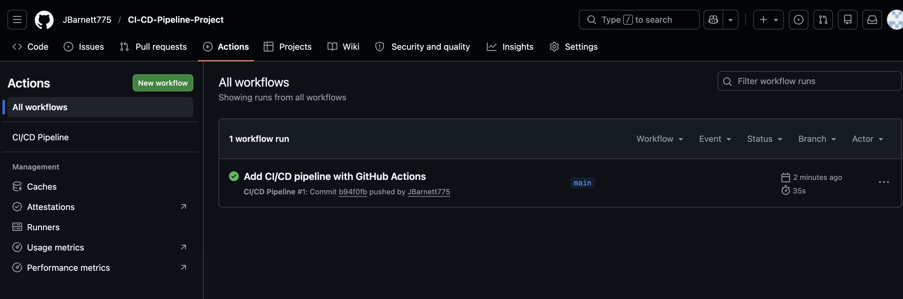 


#### As can be seen in the above image, I have a workflow set up in the actions part of GitHub, this shows that the push was successful 
#### I can also check Docker Hub to see if the latest image version has been uploaded there, from the below I can see it has

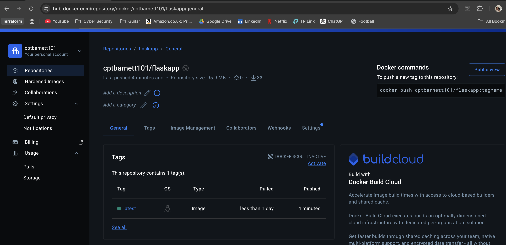

## - Summary -
#### In this project, I built a CI/CD pipeline for a Dockerized Flask application using GitHub Actions. The pipeline automatically installs dependencies, runs Python tests with pytest, builds a Docker image, and pushes the image to Docker Hub whenever code is pushed to the main branch.

#### This project helped me develop a better understanding of Git workflows, GitHub Actions, automated testing, Docker image management, and the fundamentals of continuous integration and continuous delivery (CI/CD).


